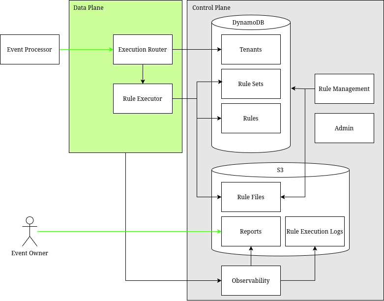

# Rules Engine

Started project from the basic server template.

Goal of the project is to have a scalable backend rules engine with
velocity features that supports a multi-tenant system, dynamic rules
and unstructured data.

The actual rules engine will be drools. The velocity service an internal
distributed counter with windows. Intended for AWS deployment and uses
DynamoDB for the velocity service and configuration. Rules are stored
in S3.

The project uses localstack for testing, with services running in ECS or
lambda. The control plan is and data plan are separate ECS services.
A front-end for management is lower-priority. (Because I hate doing UIs.)

# Component model
[](https://viewer.diagrams.net/?tags=%7B%7D&lightbox=1&highlight=0000ff&edit=_blank&layers=1&nav=1&dark=auto#R%3Cmxfile%3E%3Cdiagram%20name%3D%22Page-1%22%20id%3D%22w2k-o-g6j9WufQSYp_mu%22%3E5Zpbk9o2FMc%2FDY%2Ft2JZt8OMusMl2dhsaOmnyqLW1Ro2wqJAB99NXwsLGlrgkXMRuszMZ61jy5Xf%2BPtI5ogP609UHBmeTZ5og0vGcZNUBg47nRb4j%2FpeGojQEYVQaUoaT0uTWhjH%2BFymjGpfmOEHzRkdOKeF41jTGNMtQzBs2yBhdNru9UtK86wymSDOMY0h061844ZPS2guc2v4R4XSyubPrqDNTuOmsDPMJTOhyywSGHdBnlPLyaLrqIyLZbbiU4x52nK0ejKGMHzUggqMvwkXxp8fubMGfnpcM%2FQJ65WUWkOTqjdXT8mKDgNE8S5C8itMB98sJ5mg8g7E8uxQ%2BF7YJnxLRcsXhKyakTwll67FgGMo%2FYdefVr3AAjGOVlsm9fQfEJ0izgrRRZ0FkSKppNRTzWXtF9BVtsmWTwKgjFBpIa0uXeMSB4rYD9Dz3cvS6%2FcfHqLoPPTc4CA9Dxjo%2BeGl6LngMD3x0czkYVwQLDAycJjhSwn86aUywPh7unbDp5yLyyBln5fBxg3OA9j3moBdVyfsmvTpXY6wrxH%2BnBMRTk8S6TlYtcToRQZWnoHV5VAFRlTCMkb8BoF51oGFGrBBkcEpHdxrtMRL8iYSE7E5Z%2FQ72oS%2FjMoPtRERlQkSnGYyJgicSNjvJUYspuw7dWKKk0Te%2Br7ppXO4oXf4Gw8NXrjYDOR231cMBU2%2BIAp0mZsAu9HFCOsrpDH4%2Fyjc5IHrKjx6U4HZBwbFXjUwb262BWy4QnHOMc2E%2BS5PML85bIFjG5uvf9QoEamgalLGJzSlGSTD2tr6%2FOo%2BT5TOFKy%2FEeeFymthzmkTZTMiiCW%2Fs%2F63D%2FKc5ixG%2BwSg3oRDliK%2Br6NaHsr33Os0hgjkeNFMic8vXFM%2BEBIZVxO8EIepPBwuJBDPGTEao%2FlccFN9xD23ullXuNtaKQS2F2xeZEPgAiArvqrx68Y32fg12DQHq%2B2Tg%2BLQVHZY%2Fv6x8u%2FdlPyDnl3%2F1C751vCIPf8EN%2BUfT0%2Bmt%2BfVzzSXazXbYcdq3CEh%2BgP%2F89vj60u3eHTcIfz966wq87wlXbck95NCD3Shmwl5VnW9s%2FJRypvenqg9%2B5OpXv1Q0J5hBlM0XS9SLGMLWxXJKkmzh01Ppv9EGcxuMJGzv2ADeubbpyJYUTlyRGCGNGjvpgxRbeTs3q1w%2FWuWIXxPc8YAcvj%2BPXHEvlHvQo4wT5ZH7Lldt%2BKpsTQQ3423XW8zhR0T4Mp4fsK61FXRyJGSn4sVwW3r%2FSSHeP5hh1yqAGp0hz5lbkogY6MnfmLiPA1Ya3FWbRhbyzj0PZEviNAY8%2BLmYIFrbnyav%2FZQg3Ld9MxxvFZp6FBtaN0aIYYFARkdrpG47dl9OyFxWw%2B9YwwWWx1mFKsFsbrySBq2VqpOa1nfa%2F3w50D%2FwHFaqimfoNZQ9SonyKprWVZRBFqyimzLKjxWVpENWYXtJDvcL6t2f797DVnZLZK6LUl1u29GU%2BBETe2YZESz%2Fglj6eX6d6Bg%2BB8%3D%3C%2Fdiagram%3E%3C%2Fmxfile%3E)

The router takes the requests for event processing, and finds the correct ruleset version
to execute. That is forward to the rules engine itself which access the rules from S3.
The audit datastore contains the execution results for later retrieval, and provides the
data needed for velocity calculations.  All details of an execution is stored as
immutable files within S3.

## Sequence Diagram

Included below is the general overview of the sequence of events for a rule execution.
Essentially we process the velocity update first, then execute the rules against the
event and velocity, then update the results in the ddb. As a consequence, the velocity
is always updated, even if the rule execution fails or the response is denied. We can
split this step to update the datastore only on success if needed, but at the cost of
latency. We can always remove values from the velocity datastore if needed. This split
out can be a future enhancement or a configuration option..


There are many examples of how to update data in dynamodb that includes incrementing values and
getting the responses back. Here is one post on it: https://aws.amazon.com/blogs/database/implement-auto-increment-with-amazon-dynamodb/

# Internal Domain Model


Note that the java objects may not contain instances of the associations, rather the 
managers will be able to access them. Example, events have an event identifier, as
do execution results. Event identifiers do not hold references to Events or 
ExecutionResults themselves.

## Velocity Model


A velocity has a definition which includes the window of the velocity, where to find the
variable name and what the path to the value should be, if any. It will also link back to
the tenant. This is uniquely identifier with the Velocity Identifier. With that, a 
velocity instance can be created for a given event, with will identify the name to be
used for the velocity (like card number) and the value of the velocity. That can be
aggregated with other velocities within the same window. It supports integers and decimals
using the Java math library.

# Sequence of events

# Execution path

## Execution Environment

The application runs within a given execution environment. These can be pre-prod,
like dev or QA; where pre-prod means environments for the development of the rule
engine. They can be production environments like Sandbox or Product, or even 
regionalize production. These environments are used by those managing rule executions.

Rules can be migrated between environments.

## Rule Management

Rules are available at the global level, tenant and event. Rules are versioned  and
placed into rulesets for the event they apply to.  Rulesets can be exported and
imported into any environment.

## Rule Engine Execution

A rule set is a given set of rules for an event, and can be versioned. 
Requests can be made against a RuleSet with a given set
of facts. Those requests are executed with creates a result. Executions can be 'live' or 'shadow'. 
Shadow results do not modify the datastore for the tenant/events, which is the history of events
and the velocity setup for them.

## Velocity

Rule executions can result in an update to a datastore for the rules themselves. 

# Testing

Running tests normally will only execute the unit tests.

If you want to run the integration tests, you need docker installed, and cdk/cdk-local 
both installed. As in

```bash
npm install -g aws-cdk
npm install -g aws-cdk-local
````

To finish the local installation, in the cdk directory, run

```bash
npm install
````

Then, to run the integration tests, run in the top-level directory:

```bash
gradle test -Pinteg
```

# License

This project is licensed under the Apache 2.0 License - see the [LICENSE](LICENSE) file for details.

# Code Rules

* Use Junit5 for testing
* Use AssertJ for assertions
* Mock external dependencies with Mockito
* Structure tests with Given-When-Then format

## Unit tests

* Use Mockito Extensions for cleaner mock initialization, such as @ExtendWith(MockitoExtension.class), @Mock and @Captor, @BeforeEach, @BeforeAll, etc
* Name test methods with descriptive names using underscores to separate words

## Integration tests

* Upload data into the s3 bucket before running tests. Can be done as a @BeforeAll as needed.
* 
