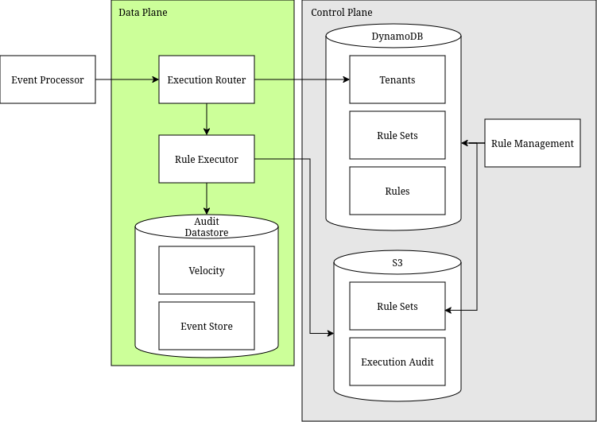

# Rules Engine

Started project from the basic server template.

Goal of the project is to have a scalable backend rules engine with
velocity features that supports a multi-tenant system, dynamic rules
and unstructured data.

The actual rules engine will be drools. The velocity service an internal
distributed counter with windows. Intended for AWS deployment and uses
DynamoDB for the velocity service and configuration. Rules are stored
in S3.

The project uses localstack for testing, with services running in ECS or
lambda. The control plan is and data plan are separate ECS services.
A front-end for management is lower-priority. (Because I hate doing UIs.)

# Component model
[](https://viewer.diagrams.net/?tags=%7B%7D&lightbox=1&highlight=0000ff&edit=_blank&layers=1&nav=1&title=Rule%20Engine%20Components.drawio&dark=auto#R%3Cmxfile%3E%3Cdiagram%20name%3D%22Page-1%22%20id%3D%22w2k-o-g6j9WufQSYp_mu%22%3E7VvbcuMoEP0aP25KEkKxHhNfZrfKqbiSrd3JI5YYmR0kXBj5sl%2B%2FYCFLMnLkmdjGlZ3KQ6AFSJzT3dAN7oFBuvnC0WL%2BxGJMe54Tb3pg2PM81wW%2B%2FKck20IS9INCkHAS60aV4JX8i7XQ0dKcxHjZaCgYo4IsmsKIZRmOREOGOGfrZrNvjDbfukAJNgSvEaKm9G8Si3kh7UOnkv%2BOSTIv3%2Bw6%2BkmKysZasJyjmK1rIjDqgQFnTBSldDPAVIFX4lL0Gx95uv8wjjNxUocQTf%2BSHEXPf9wvVmLytOb4N9AvhlkhmusZ668V2xICzvIsxmoUpwce13Mi8OsCRerpWpIuZXORUllzZfEboXTAKOO7vmAUqD8p16%2FBXODN0Qm4e1ikPmGWYsG3sonuAEKNpFalvq6uK178Ev15jZOg1CWkdSHZD13BJQsasR9Ar9SCGlg4luqjq4yLOUtYhuiokj424azaTBhbaBD%2FwUJstS2gXLAmxBIuvv2q%2B%2B8qb6pyB8vqcFN%2FONyWtQ0RX6uWsvZWjijLVSdVKfsU81OTep80iQHLeYTfAcsvzRfxBIv3GgbtasAxRYKsml9ydk7Lz7yURQwG43EYnsciXNhpER5osQhwMYtwQTd60hEuVDHaUiJh5KAbw1kB%2BGS2F6Doe7Kj4TkXchis5cvCaFx4HoB9vwmw65oIu0ELwnsqzo%2BwbyD8klO5RH5ISc%2BBVdDEygtbsPLa%2FPPFoIKtUEnJKxY3CJhnHbDAAGy4zVDKho8GWnLeoglJG2JLwdl3XLq%2FjClDbXhELUKUJJnyCRI7LOWPClkit2EP%2BkFK4rhl%2BTwHDX3YaeNtJg4uxsL9p%2Fahfgu%2Be3dZB9gNL4awuet9BZ9XwyHsZuC6Gh4ec8xjcotLmQ9te%2BbyZSZiow2OckFYJssTltgHDx6EadD6suabtn2FMK3pGOTO378fj53xeYMqT0%2BtM6jy%2FHbSrhNUeW1hQUCVe43JShYTVRyt1Pw9Z8pZhJdLiZtuI99Za2Zdw92DoMC%2BdwhtKPjP5iHOqf7%2Bqerft6n%2BsG%2BXn4qStwYjN8QPtOqezJi6vqy%2BsFxt2Wy7He8wGWHd7wDXAOV%2F4nfgiXrtWl12gRk4%2FuKnJRKx5neOJqgK98Nuz%2Bl41p2OZyapNGhPKEMJTnebSMuwBQch9z6WtgebmVV6iFOS3RxUoC3Hfl2ozPTQnzhD2Q3mjG9gD2D5DPTOcfvNdcb3wq6TUFWbYk4kBCoXZ2%2F5sbrtLe9mWKLOvXOc8GCLIHcslqkLTqUOWKUO2qXO3s7uZH4%2BurPbdX3gHG1rDRaM6GVAjzxVgtpiBg7W%2FeDgUk5He7%2FvHOhG8QWVpuyn8gHlMdPvAyYJY6rnlKIMG8r1ac5CwH3nlQnXb1k%2FL3YW4nsGGUMk0Odn4oTLK22ngpcjwnIStZmkc6%2FnUv1TXWrt2qKNJKrlZMbt8wOPGNyVLs6ZcfnzbIn5Cs0IJWJrsGc7dgqsH0xC867hC15ILb29QNP%2BKS60u%2BX9wWTmVU5%2F4amnv3Y9AzRPf8uj3ud11nKyUt5uylP6EKksaLUvmaAZplO2JLuzGTCcMSFY2rJxEezAKFhxyWmw%2F6HA2W7XdBpK2x3cn7ATWa1%2BLlAEA9WPLsDoPw%3D%3D%3C%2Fdiagram%3E%3C%2Fmxfile%3E)

# Sequence of events

# Execution path

## Execution Environment

The application runs within a given execution environment. These can be pre-prod,
like dev or QA; where pre-prod means environments for the development of the rule
engine. They can be production environments like Sandbox or Product, or even 
regionalize production. These environments are used by those managing rule executions.

Rules can be migrated between environments.

## Rule Management

Rules are available at the global level, tenant and event. Rules are versioned and only
one version can be active at a time in a given execution environment.  Rules can be exported
or imported into environments, and enabled or run in shadow mode. They exist in as versions
in an environment.

## Rule Engine Execution

A rule set is a given set of rules of the three types; global, tenant and event. The types of
rules exist within a given version. Requests can be made against a RuleSet with a given set
of facts. Those requests are executed with creates a result. Executions can be 'live' or 'shadow'. 
Shadow results do not modify the datastore for the tenant/events, which is the history of events
and the velocity setup for them.

## Velocity

Rule executions can result in an update to a datastore for the rules themselves. 

# Testing

Running tests normally will only execute the unit tests.

If you want to run the integration tests, you need docker installed, and cdk/cdk-local 
both installed. As in

```bash
npm install -g aws-cdk
npm install -g aws-cdk-local
````

To finish the local installation, in the cdk directory, run

```bash
npm install
````

Then, to run the integration tests, run in the top-level directory:

```bash
gradle test -Pinteg
```

# License

This project is licensed under the Apache 2.0 License - see the [LICENSE](LICENSE) file for details.

# Code Rules

* Use Junit5 for testing
* Use AssertJ for assertions
* Mock external dependencies with Mockito
* Structure tests with Given-When-Then format

## Unit tests

* Use Mockito Extensions for cleaner mock initialization, such as @ExtendWith(MockitoExtension.class), @Mock and @Captor, @BeforeEach, @BeforeAll, etc
* Name test methods with descriptive names using underscores to separate words

## Integration tests

* Upload data into the s3 bucket before running tests. Can be done as a @BeforeAll as needed.
* 
